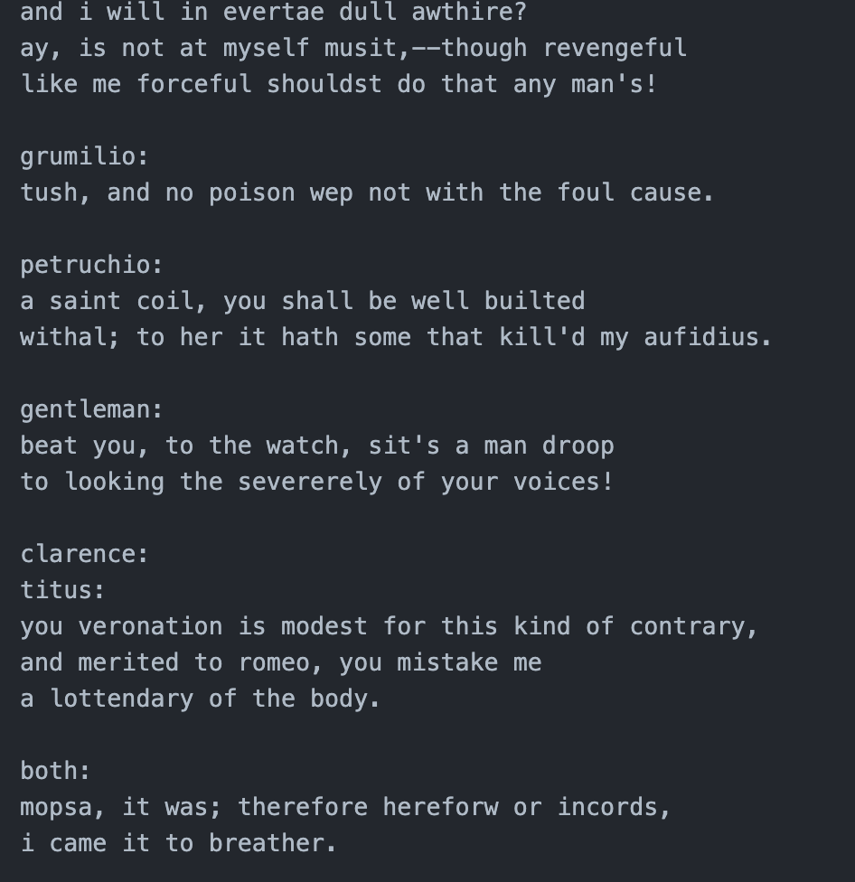

# NanoGPT

NanoGPT is a small-scale attempt to build a GPT-like language model from scratch. This project explores the fundamentals of transformer-based architectures and language modeling using a tiny dataset.

## Overview

This project implements a minimalistic version of a GPT-style model. It is trained using a tiny Shakespeare dataset and aims to generate text in a similar style. The training process follows standard deep learning techniques for language modeling, leveraging a simplified transformer architecture.

## Features

- Small-scale GPT-style language model
- Trained on a tiny Shakespeare dataset
- Minimal implementation for educational purposes
- Outputs sample generated text in `out.txt`

## Files

- `nanogpt.py` - The script implementation of the NanoGPT model
- `nanogpt.py` - The notebook implementation of the NanoGPT model
- `out.txt` - A sample output of the trained model
- `screenshot.png` - Screenshot of the output
- `README.md` - Project documentation

## Output Screenshot

